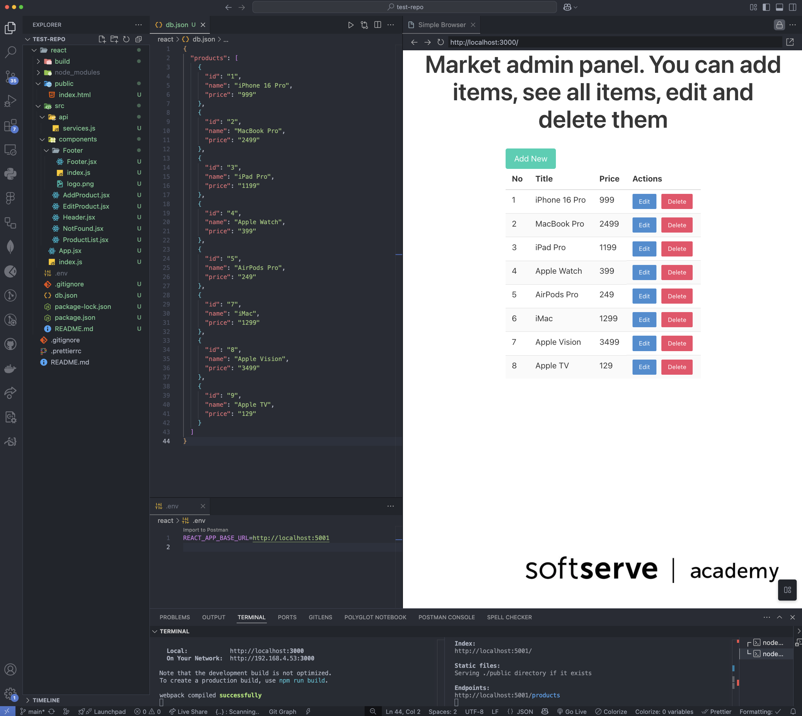
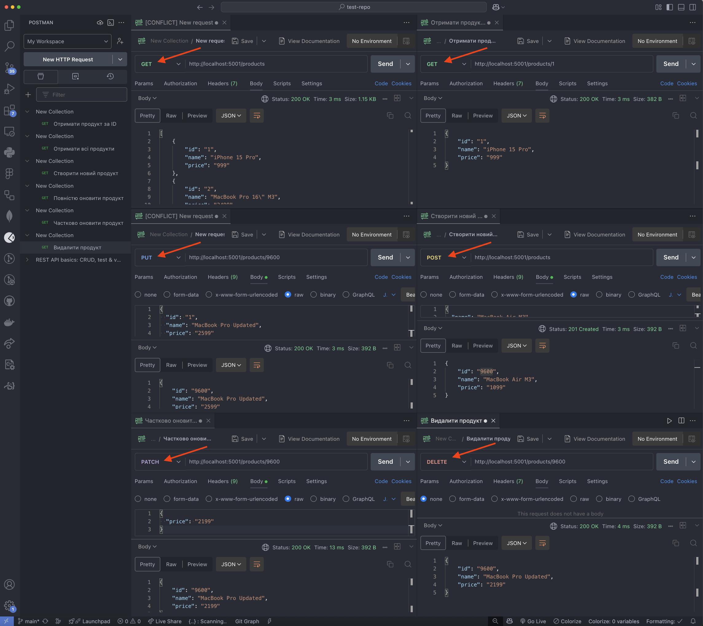
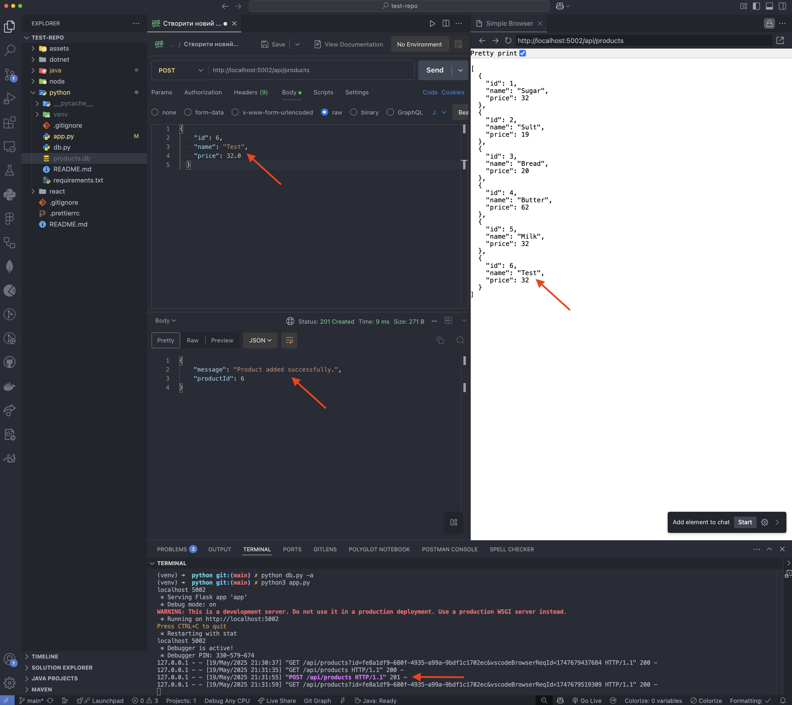
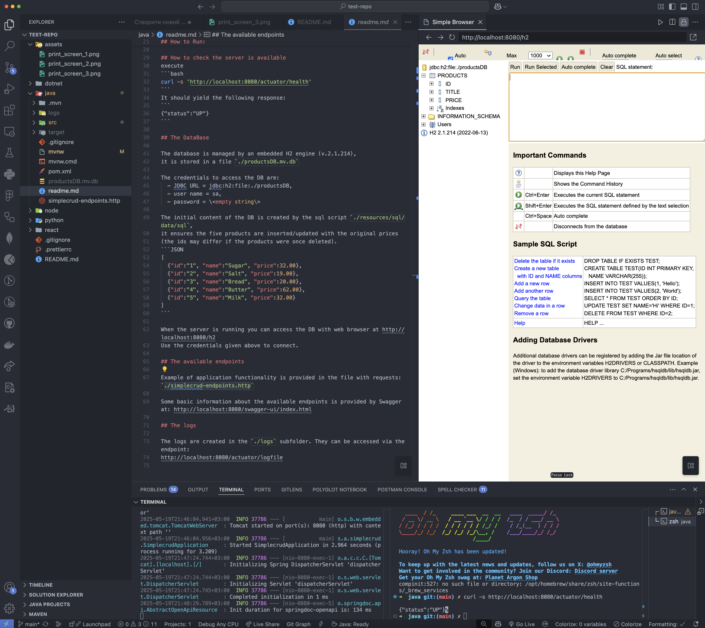

# Assignment Rest API - DevOps for Developers

### Task 1 (React)

### Task (Python)

### Task (Java)

> [!NOTE]
>
> 1

> [!TIP]
>
> 2

> [!IMPORTANT]
>
> 3

> [!WARNING]
>
> 4

> [!CAUTION]
>
> 5
