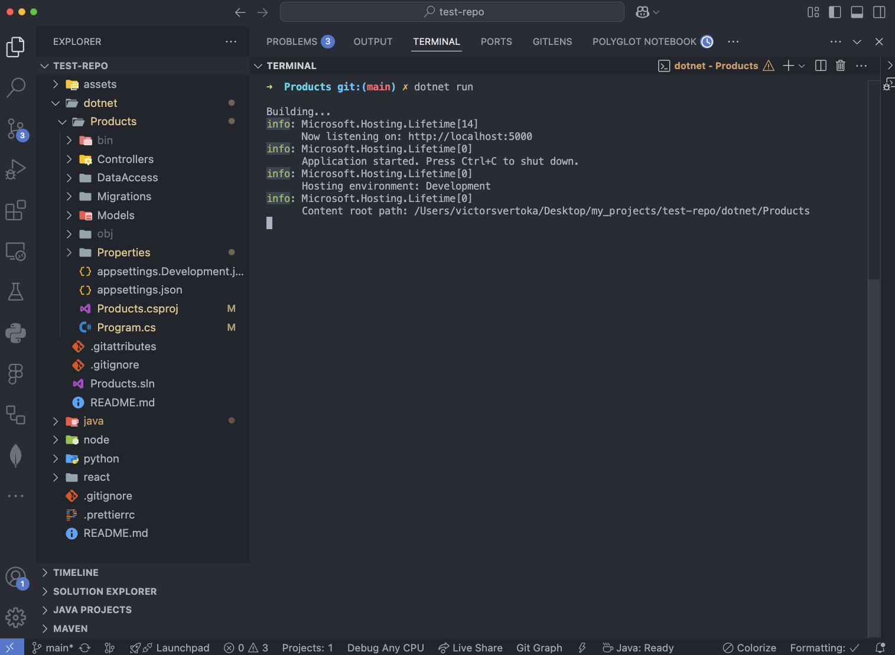
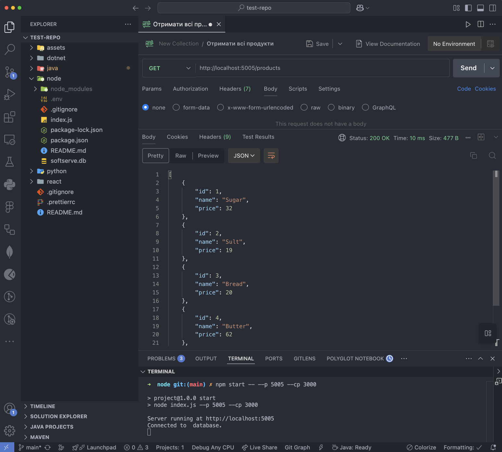

# Assignment Rest API - DevOps for Developers

### Task 1 (React)

### Task 2 (Python)

### Task 3 (Java)

### Task 4 (.NET)

### Task 5 (Node)

> [!NOTE]
>
> 1

> [!TIP]
>
> 2

> [!IMPORTANT]
>
> 3

> [!WARNING]
>
> 4

> [!CAUTION]
>
> 5
